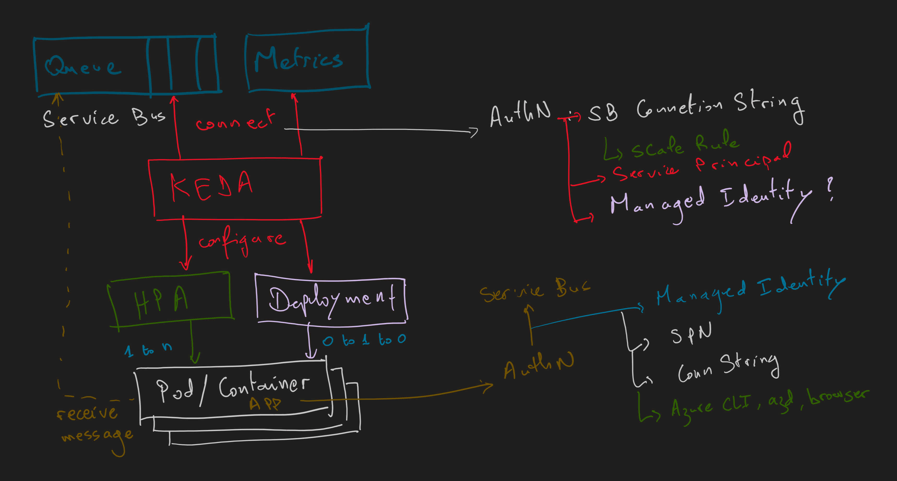
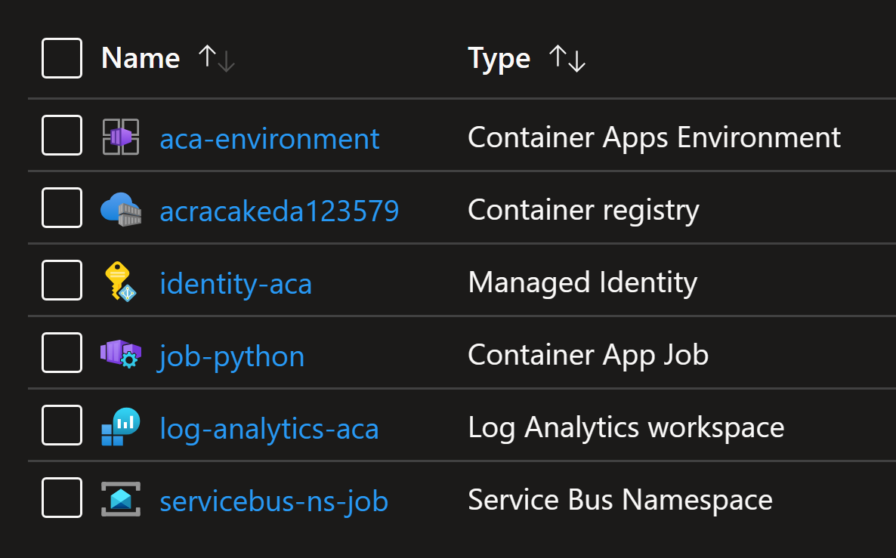
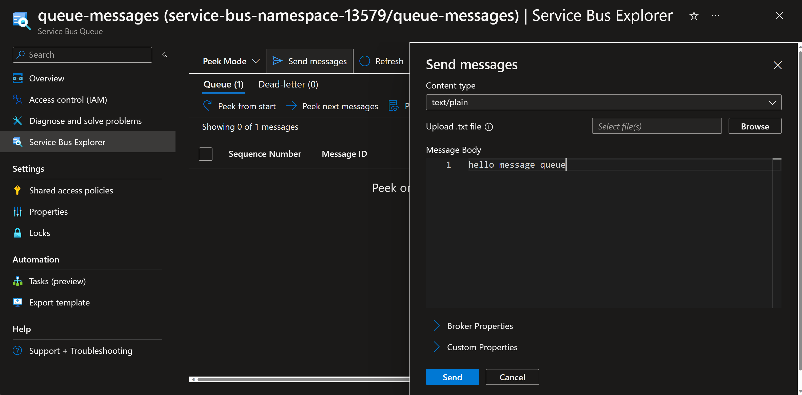
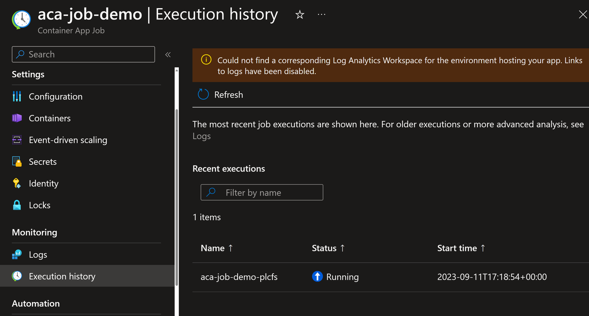
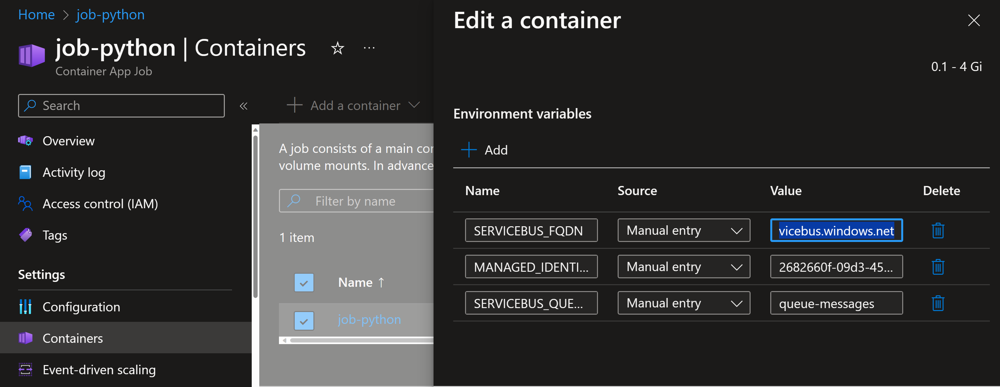
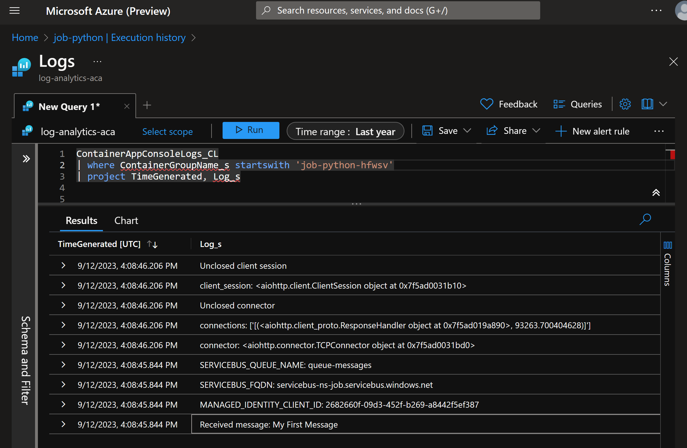

# Autoscaling Jobs using KEDA and Service Bus

## 1. Introduction

You will learn how to use KEDA to trigger autoscaling of Container Apps Jobs based on number of messages within a Queue.
When you create a new message within Service Bus Queue, KEDA will be listening and will trigger Container Apps to add more replicas of a a Job.
The Job will connect to the Queue to receive messages and process it.



## 2. Demonstration: triggering Jobs using KEDA

You will work with KEDA to trigger autoscaling Jobs when there are new messages within a Service Bus Queue.
You wil be using `Python` to create a sample application that will perform the following operations:
1. Connect to Service Bus Queue
2. Receive a message
3. Process the message and mark it as complete

### 4.1. Deploy the resources

You will use Terraform to deploy the following resources:
1. Container Apps Environment
2. Azure Service Bus
3. Service Bus Queue
4. Container Apps Job
5. Azure Container Registry
6. Container image that will process the message
7. Log Analytics workspace

>Note that the terraform code will build a container image by running `az acr build` command.

To do that, run the `terraform` commands to initialize the module, plan the changes and deploy the resources.
Make sure you are within the folder containing terraform files.
You can use Azure `Cloud Shell` as it have terraform installed. In that case, first you will need to `git clone` the repository to cloud shell.

```shell
terraform init
terraform plan -out tfplan
terraform apply tfplan
```

After that, check the deployed resources.



You will send a message to the Service Bus Queue.



Then you will watch for a triggered Job.



Check the `scale-rule` used to configure how KEDA will autoscale the Job.

```shell
az containerapp job create \
   --name job-python \
   --resource-group ${azurerm_resource_group.rg.name} \
   --environment ${azurerm_container_app_environment.aca_environment.name} \
   --trigger-type "Event" \
   --replica-timeout 86400 \
   --replica-retry-limit 1 \
   --replica-completion-count 1 \
   --parallelism 1 \
   --image ${azurerm_container_registry.acr.name}.azurecr.io/job-python:${var.image_tag} \
   --registry-identity ${azurerm_user_assigned_identity.identity_aca.id} \
   --registry-server ${azurerm_container_registry.acr.name}.azurecr.io \
   --cpu 0.25 \
   --memory 0.5 \
   --min-executions 0 \
   --max-executions 1 \
   --secrets service-bus-connection-string="${azurerm_servicebus_namespace.service-bus.default_primary_connection_string}" \
   --scale-rule-name azure-servicebus-queue-rule \
   --scale-rule-type azure-servicebus \
   --scale-rule-auth "connection=service-bus-connection-string" \
   --scale-rule-metadata "queueName=${azurerm_servicebus_queue.queue-messages.name}" \
                         "namespace=${azurerm_servicebus_namespace.service-bus.name}" \
                         "messageCount=1" \
   --env-vars \
       SERVICEBUS_FQDN="${azurerm_servicebus_namespace.service-bus.name}.servicebus.windows.net" \
       MANAGED_IDENTITY_CLIENT_ID=${azurerm_user_assigned_identity.identity_aca.client_id} \
       SERVICEBUS_QUEUE_NAME=${azurerm_servicebus_queue.queue-messages.name}
```

The autoscaler needs to authenticate to Azure Service Bus to count the number of messages. For that it uses the Service Bus Connection String, namespace and Queue name.
Note how this configuration will trigger a new Job each time you have at least one message within the Queue ("messageCount=1").

Note also how the container will connect to Service Bus through User Assigned Identity to receive messages.
For that you inject environment variables into the Job like the following.
Note how the values are from the terraform configuration.

```bash
--env-vars \
    SERVICEBUS_FQDN="${azurerm_servicebus_namespace.service-bus.name}.servicebus.windows.net" \
    MANAGED_IDENTITY_CLIENT_ID=${azurerm_user_assigned_identity.identity_aca.client_id} \
    SERVICEBUS_QUEUE_NAME=${azurerm_servicebus_queue.queue-messages.name}
```

These values will be used by the application written in `python` programming language.
Here is part of the python code from the file `processor.py` that will read these environment variables.

```python
SERVICEBUS_FQDN = os.getenv("SERVICEBUS_FQDN")
SERVICEBUS_QUEUE_NAME = os.getenv("SERVICEBUS_QUEUE_NAME")
MANAGED_IDENTITY_CLIENT_ID = os.getenv("MANAGED_IDENTITY_CLIENT_ID")
```

The object `DefaultAzureCredential` will handle the authentication to Azure subscription.
It supports multiple authentication options like Azure CLI, Managed Identity, Workload Identity, Service Principal, etc.
DefaultAzureCredential will try the authentication options one by one until it succeeds.
You can enable or disable the authentication options.

```python
credential = DefaultAzureCredential(
  exclude_visual_studio_code_credential=True, 
  exclude_interactive_browser_credential=True, 
  exclude_environment_credential=True, 
  exclude_workload_identity_credential=True,
  exclude_developer_cli_credential=True,
  exclude_powershell_credential=True,
  exclude_shared_token_cache_credential=True,
  exclude_managed_identity_credential=False,
  exclude_cli_credential=False,
  managed_identity_client_id=MANAGED_IDENTITY_CLIENT_ID)
```

For more information, visit this page: [DefaultAzureCredential class](https://learn.microsoft.com/en-us/python/api/azure-identity/azure.identity.defaultazurecredential?view=azure-python)

The python application was configured to use your user identity from Azure CLI to authenticate to Azure.
That is why you have `exclude_cli_credential=False`.
This is useful when running the python code from your local machine.
When the code will be deployed into a container and then into Container App Job, it will fail to get a user identity through Azure CLI.
As a result, it will try to use a Managed Identity.
For that, in the terraform code, you will see that the Job is using an environment variable to get Managed Identity client ID.

```terraform
MANAGED_IDENTITY_CLIENT_ID=${azurerm_user_assigned_identity.identity_aca.client_id}
```

You can verify that in Azure portal.


Check the logs generated by the job. Note the log showing the message content.



## Conclusion

You learned in this lab how to send and receive messages from a Queue and triggered Jobs to process it.